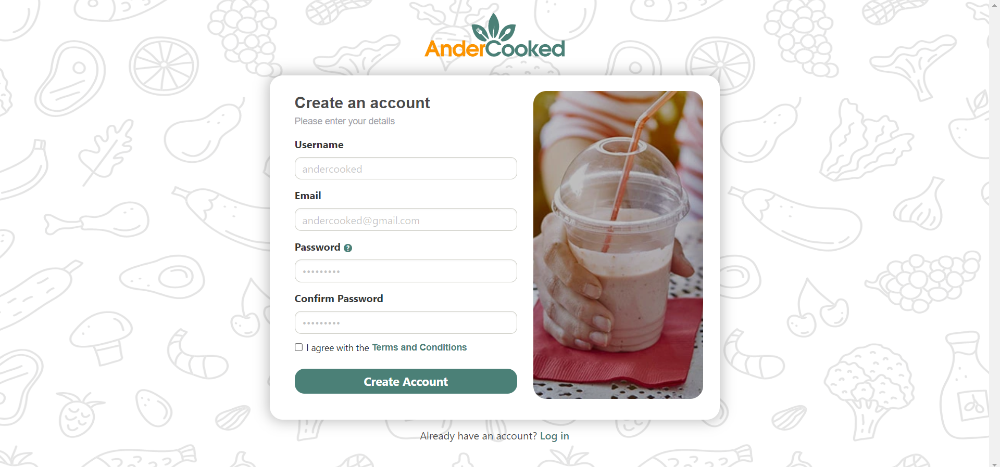
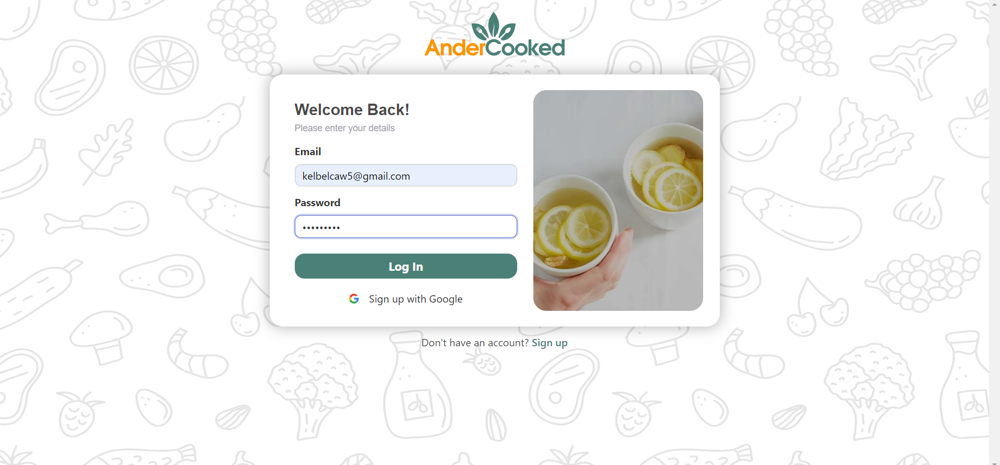
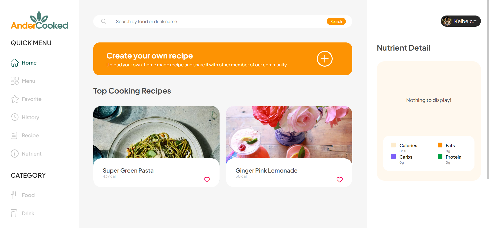
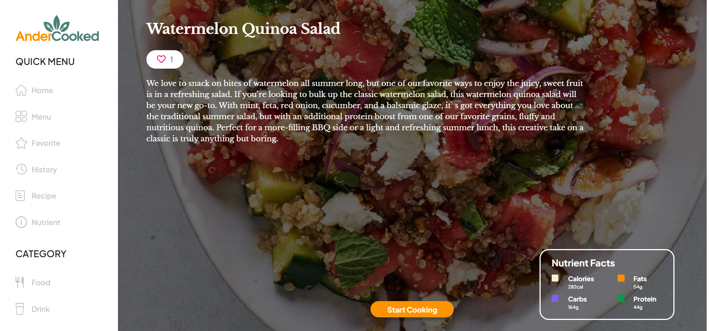
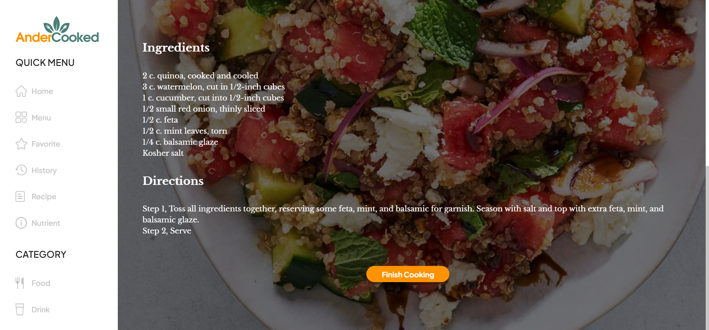
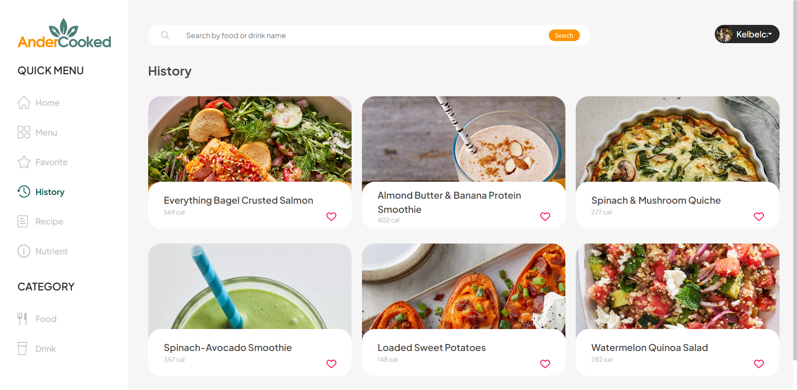
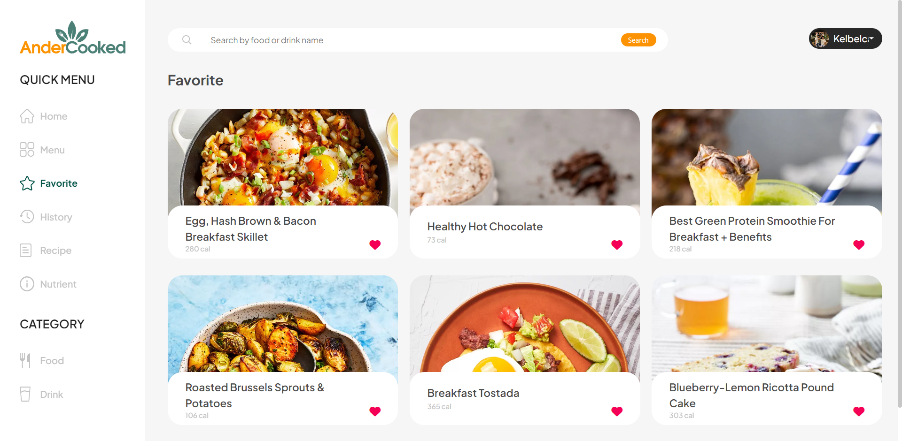
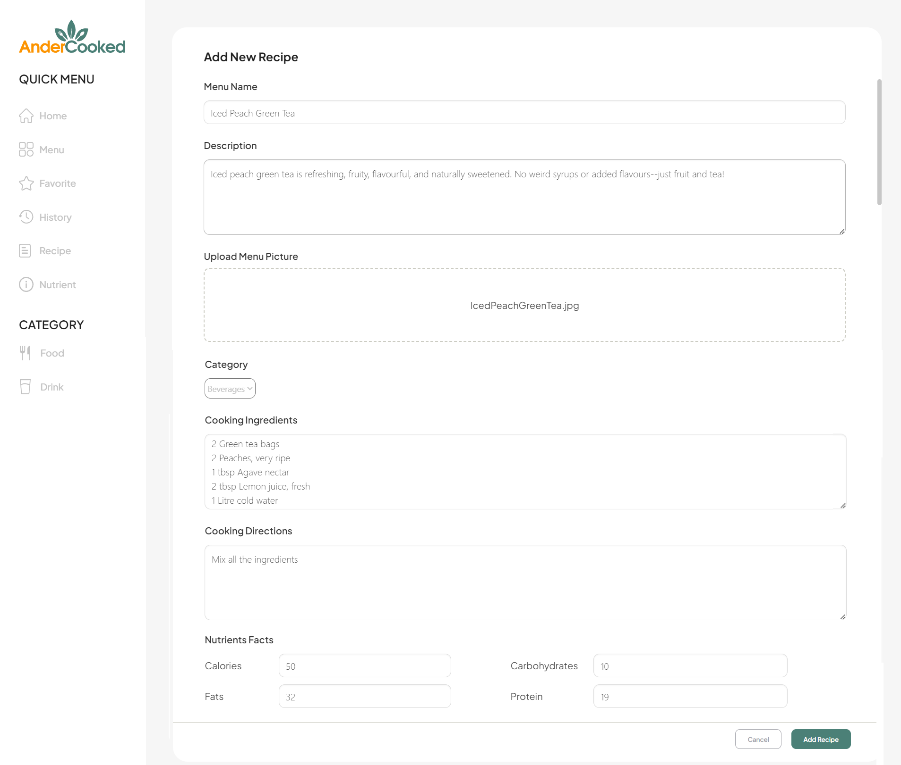
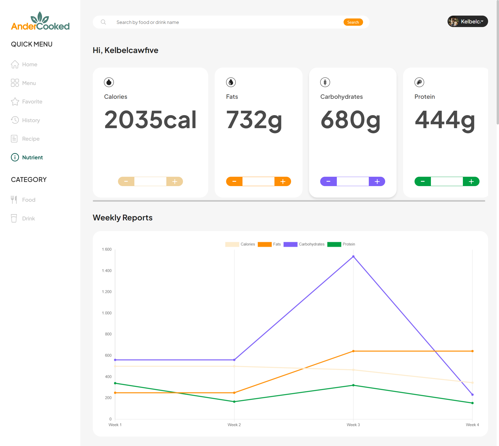

<div align="center">
    
</div>

## Description 🎯
[Andercooked](http://andercooked.000webhostapp.com/) is a useful website focused on helping people find healthy and flavorful food with nutrition tracking as our main feature.
It's easier to find healthy recipes here. Apart from food, various healthy and delicious drinks from exotic drinks to relaxing drinks are also available here. Let's start an interesting journey with Andercooked find your treasury healthy menu!

## How to Install and Run the Project 🏃
1. Clone the project from Stefanus Luigi repository
``` bash 
git clone https://github.com/StefanusLuigiMarcellino/andercooked.git 
```
2. Move to andercooked directory
``` bash
cd andercooked 
```
3. Installing composer to read .json file
``` bash
composer install 
```
4. Create new file by copying .env.example and rename it to .env
``` bash
cp .env.example .env 
```
5. Generate a unique key for Laravel project
``` bash
php artisan key:generate 
```
6. Installing laravel Bulma framework
``` bash
npm install bulma 
```
7.  Create table for this project
``` bash
php artisan migrate 
```
8. Get data from seeder
``` bash
php artisan db:seed 
```
9. Uploading picture to Andercooked website
``` bash
php artisan storage:link 
```
10. Installing Laravel library for UI
``` bash
composer require laravel/ui 
```
11. Installing Laravel library for socialite
``` bash
composer require laravel/socialite 
```

[PDF Manual Guide How to Use Andercooked💁](https://drive.google.com/file/d/1aoHpdwnSpCISnItTLRZQ0jYC__1Yq4DS/view?usp=drive_link)

## Website preview 💻
- **Register**
<div align="center">
    
</div>

- **Login**
<div align="center">
    
</div>

- **Home**
<div align="center">
    
</div>

- **Menu Description**
<div align="center">
    
    
</div>

- **History**
<div align="center">
    
</div>

- **Favorite**
<div align="center">
    
</div>

- **Add Recipe**
<div align="center">
    
</div>

- **Nutrient**
<div align="center">
    
</div>

## Contributors ✨

Thanks go to these wonderful people:

<a href="https://github.com/StefanusLuigiMarcellino/andercooked/graphs/contributors">
  
</a>
